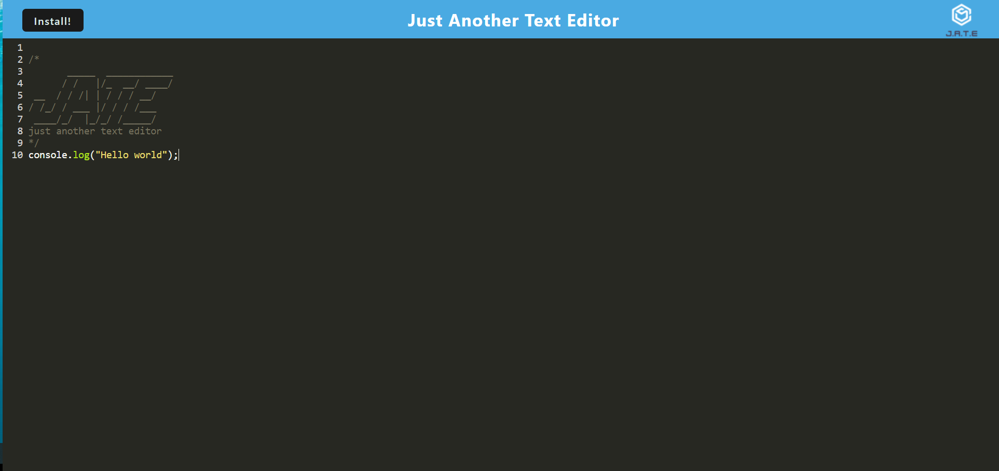
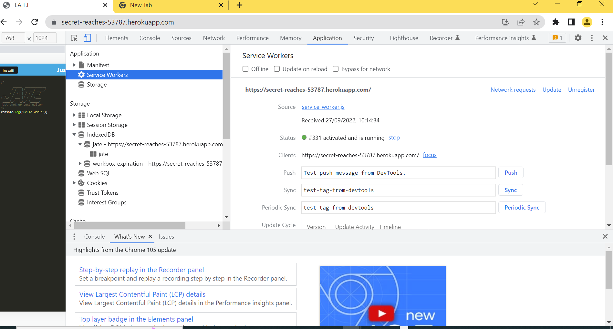
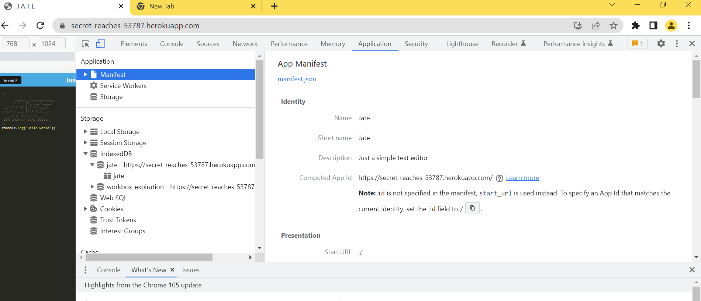
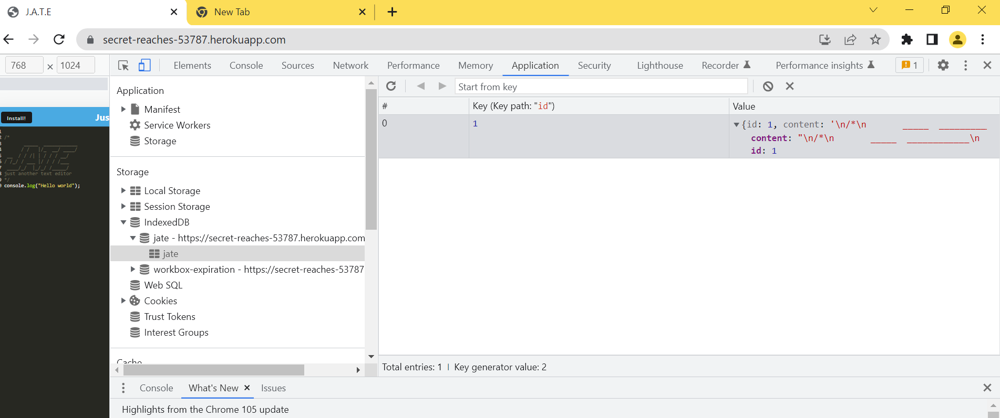
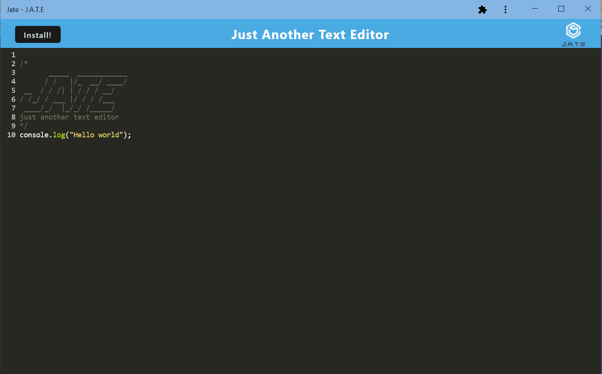

# JATEApplication

## Table of Contents
* [Description](#description)
* [Application Live URL](#application-live-url)
* [Installation](#installation)
* [Usage](#usage)
* [License](#license)
* [Contributing](#contributing)
* [Test Instruction](#tests)
* [Screenshots](#screenshots)
* [Github Link](#github)
* [Reach me for any additional queries](#email)

## Description
This is a single-page text editor that runs in a browser and meets the PWA criteria. It features a number of data persistence techniques that serve as redundancy in case one of the options is not supported by the browser. The application is deployed on Heroku and also functions offline. 

## Application Live URL
The TechBlog live URL:

[The JATE application Live URL here](https://secret-reaches-53787.herokuapp.com/)

## Installation
* To install the application's dependencies and devDependencies, run:
    - npm install
* To invoke the application, run:
    - npm run start

## Usage
View the deployed application where you will be presented with a code/text editor Any code or text you add will save automatically whenever you click off of the window. On refresh or revisit, the text is persistent and saved in IndexedDB.

## License

## Contributing
 Mahalakshmi Rajendran

## Test Instructions
- Run npm run start from the root directory

- The user opens the text editor, the user will find the IndexedDB has immediately created a database storage.

- When the user enters content and subsequently clicks off of the DOM window, the content in the text editor is saved with IndexedDB.

- When the user reopens the text editor after closing it, the content in the text editor has been retrieved from the IndexedDB.

## Screenshots
Browser Version:

Service Broker:

Manifest:

IndexedDB:

Local Version:(Downloaded Version)

## Github
Visit my github profile here: [Maharjn](https://github.com/Maharjn)

## Email
Email me with any questions : maharajendran.89@gmail.com
